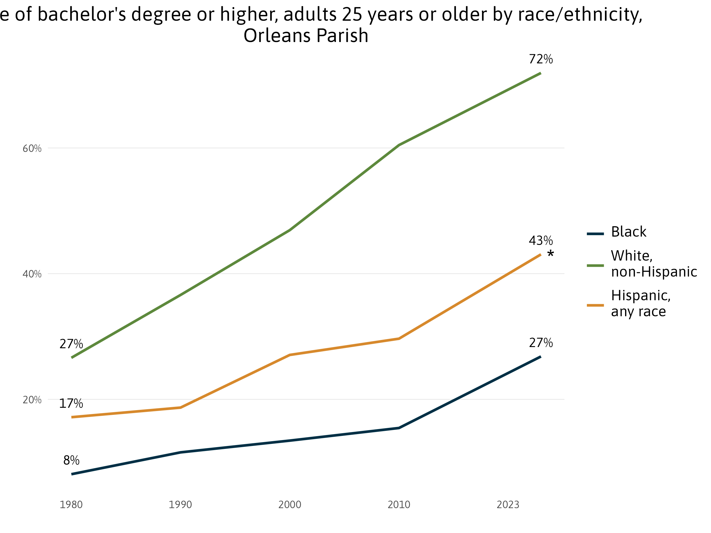
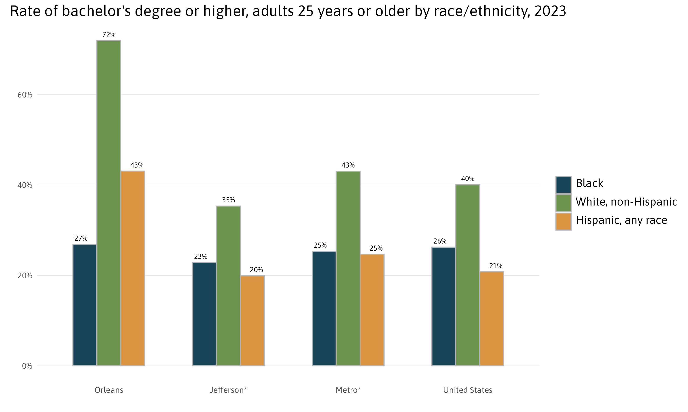
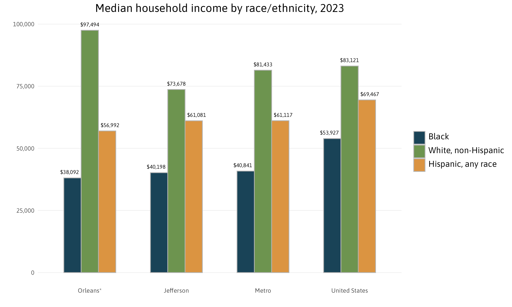
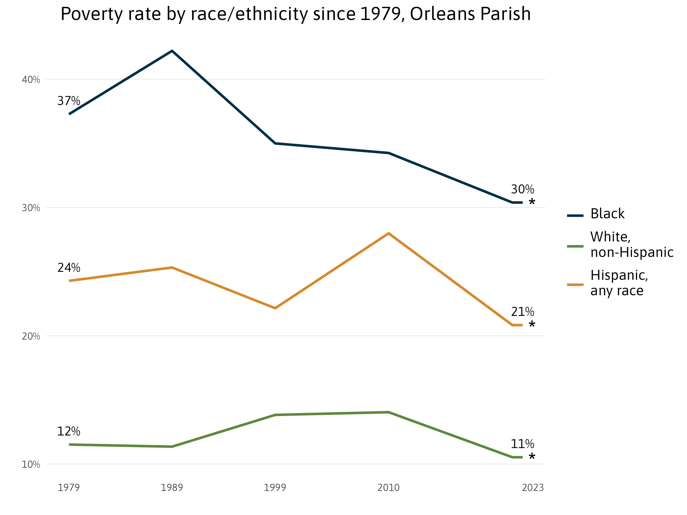
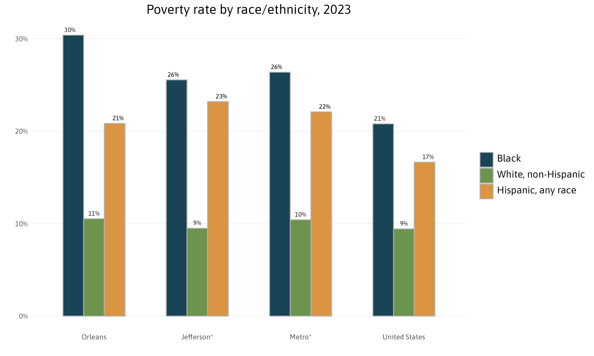
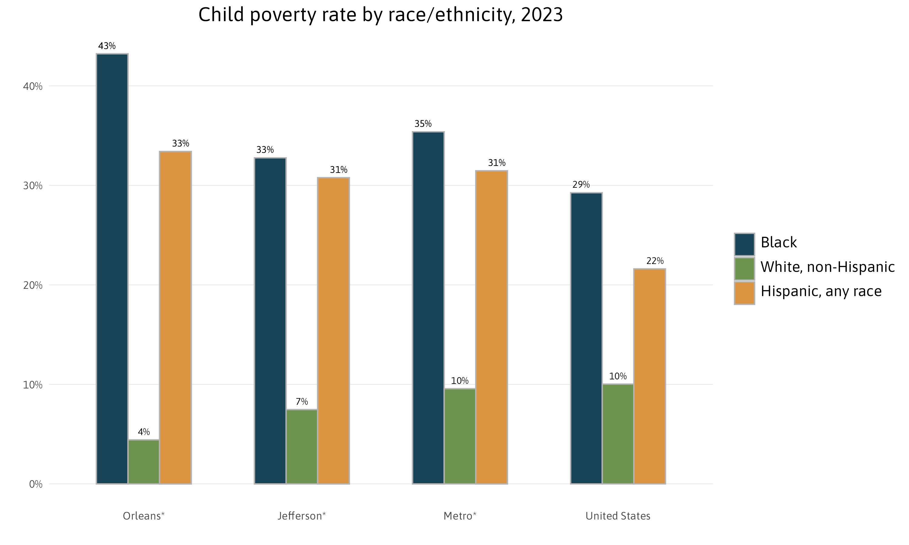

```{r, include=FALSE}

## Configure outputs for easy cutting-and-pasting
# In YAML header, specify output: md_document
# For Wordpress, specify variant: markdown_phpextra+backtick_code_blocks

## Configure URL paths for embedded charts and fig and table formatting for easy cutting-and-pasting

# At present, charts called in this Rmd will be saved to a local subdirectory \wp-graphics\uploads.
# The contents of this subdirectory will have to be uploaded manually in Wordpress. 

# base.dir, base.url, and fig.path control where the figures will be saved locally and how the links will be written in markdown. The links should match where the files are uploaded to WP. 
# base.dir and base.url fall under knit options; fig.path falls under chunk options

#base.dir <- "wp-graphics"
#base.url <- "http://www.datacenterresearch.org/a/wp-content/"

# Set date path manually
# fig.path <- "uploads/2018/07/" 

# Set date path with auto generated month and year
fig.path <- paste0("uploads/", 
                   format(Sys.Date(), format="%Y"),"/",
                   format(Sys.Date(), format="%m"),"/") 

#knitr::opts_knit$set(base.dir = base.dir, base.url = base.url)

knitr::opts_chunk$set(fig.width=5, fig.height=5,  # use fig.width and fig.height to globally set figure sizes.
               fig.path = fig.path,
               message = F,
               warning = F,
               error =  F) 
options(knitr.table.format = 'markdown') # Specify that kable will create md-formatted tables. 

```

```{r, include=FALSE}

# Tidyverse is not necessary (but an expedient for generating working examples). 
library(tidyverse)
library(scales)
library(extrafont)
# Load helper functions to control CSS styles. See below for examples of how to call the functions. 
library(here)
source(here("css_helper.R"))
knitr::opts_chunk$set(fig.width=5, fig.height=5, warning = FALSE)  # use fig.width and fig.height to globally set figure sizes.
              
options(knitr.table.format = 'markdown') # Specify that kable will create md-formatted tables. 


```

```{r setup, include=FALSE}

loadfonts() # Necessary to load custom fonts, not sure if necessary if I load fonts from another package.
knitr::opts_chunk$set(echo = FALSE)
#knitr::opts_knit$set(root.dir = '/Users/username/path_to_project')
```


```{r, echo=FALSE, include=FALSE, results = FALSE}
# Load required scripts in order. 
# Note: here() uses the relative path to the same directory.

source(here("01_libraries.R"))
```
```{r, echo=FALSE, include=FALSE, results = FALSE}
source(here("css_helper.R"))
```
```{r, echo=FALSE, include=FALSE, results = FALSE}
source(here("02_variables.R"))
```
```{r, echo=FALSE, include=FALSE, results = FALSE}
source(here("03_functions.R"))
```
```{r, echo=FALSE, include=FALSE, results = FALSE}
source(here("02_variables.R"))
```
```{r, echo=FALSE, include=FALSE, results = FALSE}
source(here("03_functions.R"))
```
```{r, echo=FALSE, include=FALSE, results = FALSE}
source(here("04_analysis.R"))
```
```{r, echo=FALSE, include=FALSE, results = FALSE}
source(here("05_graphics.R"))
```
```{r, echo=FALSE, include=FALSE, results = FALSE}
source(here("inline.R"))
```
```{r}
# For Asap font
#font_add_google("Asap")
#showtext_auto() # Turns on showtext fonts
```


```{r, echo=FALSE}
makeCSS_highlight(
"This brief examines the most current demographic data released by the U.S. Census Bureau and identifies important trends in metro area parishes. Included are data on race and ethnicity, age, educational attainment, internet access, poverty, income, children, access to vehicles, foreign-born population, geographic mobility, homeownership, homeowners with a mortgage, housing costs and affordability, single-person households, commuting, and housing stock.") 
```


The U.S. Census Bureau estimates that `r comma(metropop.current)` residents were living in metro New Orleans as of July `r yearPEP`, a `r round((pctincrease.metro.current.2010)*100)` percent increase from April 2010.[^1] The metro area now has `r round((metropop.current / 1337726)*100)` percent of its 2000 population of 1,337,726. In this brief, we examine demographic data released by the U.S. Census Bureau and identify important changes in metro area parishes since 2000 (or the best benchmark available).


## Race/Ethnicity

According to the U.S. Census Bureau’s `r yearPEP` population estimates, there are now `r comma(getvalue.AA.no.2000-getvalue.AA.no.current)` fewer African Americans living in New Orleans (Orleans Parish) compared to 2000, but there are also `r comma(getvalue.white.no.2000 - getvalue.white.no.current)` fewer whites. Meanwhile, the number of Hispanics grew by `r comma(getvalue.Hispan.no.current - getvalue.Hispan.no.2000)`.[^2]

```{r AAWhiteHispan, fig.align='center', fig.width=7, fig.height=5, echo=FALSE, warning=FALSE, message=FALSE}
AAwhthispGraphic
```

```{r, echo=FALSE}
makeCSS_source(
"**Source**: The Data Center analysis of U.S. Census Bureau data from Census 2000 and Population Estimates 2019."
)
```


```{r, echo=FALSE}
makeCSS_highlight(
"### What is Orleans Parish? 

Orleans Parish is the city of New Orleans. New Orleans and Orleans Parish are interchangeable. Their boundaries are the same, and they contain the same population. "
)
```

In Orleans Parish, the share of the `r yearPEP` population that is African American — while lower than in 2000 when it was `r round((getvalue.AApct.no.2000)*100)` percent — continues to represent the majority of city residents at `r round((getvalue.AApct.no.current)*100)` percent. The share of Hispanics in the city increased from `r round((getvalue.Hispanpct.no.2000)*100)` percent in 2000 to `r round((getvalue.Hispanpct.no.current)*100)` percent in `r yearPEP`; the share of Asians increased from `r round((getvalue.Asianpct.no.2000)*100)` percent to `r round((getvalue.Asianpct.no.current)*100)` percent; and the share of whites increased from `r round((getvalue.whitepct.no.2000)*100)` percent to `r round((getvalue.whitepct.no.current)*100)` percent. Meanwhile, Hispanic, Asian, and African American populations increased as a share of the total population in Jefferson, St. Bernard, St. Charles, St. John the Baptist, and St. Tammany parishes, each. In fact, the number and share of Hispanics have increased in all eight parishes in the metro area.

```{r demoallparish, fig.align='center', fig.width=10, fig.height=16, echo=FALSE, warning=FALSE, message=FALSE}
chart.demo.allparishes
```
```{r, echo=FALSE}
makeCSS_source(
"**Source**: The Data Center analysis of U.S. Census Bureau data from Census 2000 and Population Estimates 2019."
)
```

Between 2000 and `r yearPEP`, the number of Hispanics in Jefferson Parish increased by `r comma(getvalue.hispan.jeff.current-getvalue.hispan.jeff.2000)` reaching over `r round((getvalue.Hispanpct.jeff.current)*100)` percent of the total parish population. Orleans Parish and St. Tammany Parish gained `r comma(getvalue.Hispan.no.current - getvalue.Hispan.no.2000)` and `r comma(getvalue.hispan.tam.current - getvalue.hispan.tam.2000)` Hispanics, respectively, such that the Hispanic share of the population was `r round((getvalue.Hispanpct.no.current)*100)` percent in Orleans and `r round((getvalue.Hispanpct.tam.current)*100)` percent in St. Tammany in `r yearPEP`.

As of July `r yearPEP`, there were `r comma(getvalue.Hispan.metro.current)` Hispanics in the metro area, representing `r round((getvalue.Hispanpct.metro.current)*100)` percent of the metro population. This is up from 2000 when there were `r comma(getvalue.hispanpop.metro.2000)`, representing `r round((getvalue.Hispanpct.metro.2000)*100)` percent of the metro population. Despite these recent gains, the Hispanic share of the population in metro area parishes is far below the average for the United States, which has grown from `r round((getvalue.Hispanpct.us.2000)*100)` percent to `r round((getvalue.Hispanpct.us.current)*100)` percent of the total U.S. population over these `r year-2000` years.

```{r hispanpop, fig.align='center', fig.width=7, fig.height=6, echo=FALSE, warning=FALSE, message=FALSE}
HispanicPopGraphic
```
```{r, echo=FALSE}
makeCSS_source(
"**Source**: The Data Center analysis of U.S. Census Bureau data from Census 2000 and Population Estimates 2019."
)
```

The number of Hispanics in New Orleans metro has grown every year since 2006. Indeed while the overall metro population has grown `r round((pctincrease.metro.current.2010)*100)` percent since 2010, the Hispanic population has grown `r round((getvalue.Hispgrowth.metro.2010.current)*100)` percent such that Hispanics account for `r comma(round((getvalue.growthpcthispanic.metro.2010.current)*100))` percent of the metro's population growth since 2010.

```{r hispanpopyear, fig.align='center', fig.width=10, fig.height=6, echo=FALSE, warning=FALSE, message=FALSE}
chart.HispanpopYears.allparishes
```
```{r, echo=FALSE}
makeCSS_source(
"**Source**: The Data Center analysis of U.S. Census Bureau data from Census 2000, 2010, Intercensal Estimates 2006-2009, and Population Estimates 2019."
)
```

Hispanic is an umbrella term comprising multiple nationalities and ethnicities. Researchers have shown that most Hispanics prefer to identify by nationality rather than by pan-ethnic terms such as “Hispanic” and “Latino.”[^3] The nationalities of Hispanics residing in metro New Orleans is quite distinct from the national Hispanic profile.

In `r year`, the largest Hispanic group in metro New Orleans was Honduran, representing `r round((getvalue.Hon.2018)*100)` percent of the Hispanic population. In comparison, Hondurans represent only `r round((getvalue.Hon.us.2018)*100)` percent of the national Hispanic population. These figures point to metro New Orleans as a hub of Honduran migration.

Not to be ignored, the Mexican population represents `r round((getvalue.Mex.2018)*100)` percent of the Hispanic population in metro New Orleans. Nevertheless, the Mexican population is much less prominent in the metro than nationally, where it represents `r round((getvalue.MexUS.2018)*100)` percent of the Hispanic population.


```{r hispan2018, fig.align='center', fig.width=7, fig.height=5, echo=FALSE, warning=FALSE, message=FALSE}
chart.hispan2018.allparishes 
```
```{r, echo=FALSE}
makeCSS_source(
"&ast; = Difference between indicated measure and the U.S. is not significant at 95% confidence interval.

**Source**: The Data Center analysis of U.S. Census Bureau data from Census 2000 and American Community Survey 2019."
)
```


## Population by age and household types
The progression of the baby boomers through the age groups, along with falling birth rates, have brought massive changes to the metro — and indeed the whole country — with many more changes yet to come.[^4] Looking at the total population in the metro by five-year age groups for 2000 and `r yearPEP`, the baby boomers are like a demographic tidal wave. Consequently, the median age of the metro has risen to 38.8 in `r year` from 34.8 in 2000.


```{r age2000, fig.align='center', fig.width=10, fig.height=5, echo=FALSE}
chart.agepop2000.allparishes
```
```{r, echo=FALSE}
makeCSS_source(
"**Source**: The Data Center analysis of U.S. Census Bureau data from Census 2000."
)
```

```{r agecurrent, fig.align='center', fig.width=10, fig.height=5, echo=FALSE}
chart.agepopCurrent.allparishes
```
```{r, echo=FALSE}
makeCSS_source(
"**Source**: The Data Center analysis of U.S. Census Bureau data from Population Estimates `r yearPEP`."
)
```

Meanwhile, the share of households with children is shrinking while the share of individuals living alone is growing — both across the metro and nation. As of `r year`, `r round((getvalue.hwc.2018)*100)` percent of households in metro New Orleans included children, down from `r round((getvalue.hwc.2000)*100)` percent in 2000. Between 2000 and `r year`, the percent of St. Tammany households with children declined from `r round((getvalue.hwc.StTam.2000)*100)` percent to `r round((getvalue.hwc.StTam.2018)*100)` percent; the percent of Jefferson households with children declined from `r round((getvalue.hwc.Jeff.2000)*100)` percent to `r round((getvalue.hwc.Jeff.2018)*100)` percent; and the percent of Orleans households with children declined from `r round((getvalue.hwc.no.2000)*100)` percent to `r round((getvalue.hwc.no.2018)*100)` percent.


```{r hwc, fig.align='center', fig.width=7, fig.height=5, echo=FALSE}
hwcGraphic 
```
```{r, echo=FALSE}
makeCSS_source(
"**Source**: The Data Center analysis of U.S. Census Bureau data from Census 2000 SF3 and American Community Survey `r yearPEP`."
)
```
As households with children have declined, the share of single-person households has grown in the metro and nationwide. The metro area share of individuals living alone grew from `r round((getvalue.sing.2000)*100)` percent in 2000 to `r round((getvalue.sing.2018)*100)` percent in `r year` — similar to the trend for Jefferson Parish where the share of households living alone grew from `r round(( getvalue.singJeff.2000)*100)` percent to `r round(( getvalue.singJeff.2018)*100)` percent. The increase was larger in Orleans Parish, which jumped from `r round((getvalue.singNO.2000)*100)` to `r round((getvalue.singNO.2018)*100)` percent.


```{r sing, fig.align='center', fig.width=7, fig.height=5, echo=FALSE, warning=FALSE, message=FALSE}
singGraphic
```
```{r, echo=FALSE}
makeCSS_source(
"**Source**: The Data Center analysis of U.S. Census Bureau data from Census 2000 SF3 and American Community Survey `r yearPEP`."
)
```

While the metro has regained much of the post-Katrina population losses, youth population is substantially lower than pre-Katrina levels. The metro had `r comma(getvalue.under18.metro.2000)` children under 18 years in 2000 and only `r comma(getvalue.under18.metro.current)` in `r yearPEP`. Much of this loss was driven by Orleans Parish, where the under 18 population declined to `r comma(getvalue.under18.no.current)` from `r comma(getvalue.under18.no.2000)`. The under 18 population is now `r round((getvalue.pct.under18.metro.current)*100)` percent of the metro population, down from 27 percent in 2000.


```{r popunder18, fig.align='center', fig.width=7, fig.height=5, echo=FALSE, warning=FALSE, message=FALSE}
popunder18Graphic
```
```{r, echo=FALSE}
makeCSS_source(
"**Source**: The Data Center analysis of U.S. Census Bureau data from Census 2000 and Population Estimates `r yearPEP`."
)
```

```{r, echo=FALSE}
makeCSS_highlight(
"### Where is data for Plaquemines, St. Bernard, St. James, St. Charles, and St. John the Baptist?

Although race/ethnicity and age data is available for all eight parishes in metro New Orleans, most other demographic data (such as educational attainment, poverty, and homeownership) is available for only the three most populous parishes of Jefferson, Orleans, and St. Tammany, as well as the metro."
)
```

## Educational attainment, income, and internet access

Educational attainment is an important determinant of household incomes, workforce skills, and regional resiliency.[^5] In New Orleans, `r round(getvalue.bachdeg.nopct*100)` percent of adults 25 and older had a bachelor's degree is `r year` - higher than the U.S. average of `r round(getvalue.bachdeg.USpct*100)` percent, and up from 26 percent in 2000.  The overall metro area share of adults with a bachelor's degree grew from 23 to `r round(getvalue.bachdeg.metropct*100)` percent - lower than the national average.


```{r bach, fig.align='center', fig.width=7, fig.height=5, echo=FALSE}
bachGraphic
```
```{r, echo=FALSE}
makeCSS_source(
"**Source**: The Data Center analysis of U.S. Census Bureau data from Census 2000 SF3 and American Community Survey `r yearPEP`."
)
```

The share of New Orleans adults who have a bachelor’s degree has grown across racial and ethnic groups since 1980. But while `r round(getvalue.bachdeg.white.nopct*100)` percent of white adults in New Orleans have a bachelor’s, only `r round(getvalue.bachdeg.black.nopct*100)` percent of Black adults have a bachelor’s as of `r yearPEP`.  The share of White adults in Orleans Parish who have a bachelor’s degree is substantially higher than the US or metro area overall: `r round(getvalue.bachdeg.white.nopct*100)` percent of White adults in New Orleans have a bachelor’s degree while that number is `r round(getvalue.bachdeg.white.maxotherpct*100)` percent or lower in neighboring parishes and the nation. Like in Orleans, only `r round(getvalue.bachdeg.black.jeffpct*100)` and `r round(getvalue.bachdeg.black.stTampct*100)` percent of Black adults have a bachelor’s degree or higher in Jefferson and St. Tammany, respectively.


```{r bach over time, fig.align='center', fig.width=7, fig.height=5, echo=FALSE}

```
```{r bach by loc, fig.align='center', fig.width=10, fig.height=6, echo=FALSE}

```

The  metro area increase in the share of adults with a bachelor’s degree or higher has been coupled with a decline in the share of adults with less than a high school degree. The proportion of adults 25 years and older with less than a high school education declined across all three of the largest parishes, leading to a metrowide decrease from 15 percent in 2000 to `r round(getvalue.noHSdeg.metropct*100)` percent in `r yearPEP`. In the city of New Orleans, the share of adults with less than a high school degree fell from 25 percent to `r round(getvalue.noHSdeg.nopct*100)` percent.

```{r hs, fig.align='center', fig.width=7, fig.height=5, echo=FALSE}
hsGraphic
```
```{r, echo=FALSE}
makeCSS_source(
"**Source**: The Data Center analysis of U.S. Census Bureau data from Census 2000 SF3 and American Community Survey `r yearPEP`."
)
```


The `r year` median household income of `r dollar(getvalue.medhh.metro.2018)` for the metro, `r dollar(getvalue.medhh.jeff.2018)` for Jefferson Parish, and `r dollar(getvalue.medhh.no.2018)` for the city are significantly lower than the U.S. median of `r dollar(getvalue.medhh.us.2018)`.


```{r medhh, fig.align='center', fig.width=7, fig.height=5, echo=FALSE}
medhhGraphic
```
```{r, echo=FALSE}
makeCSS_source(
"&ast; = Difference between 1999 and `r yearPEP` is not significant at 95% confidence interval.

**Source**: The Data Center analysis of U.S. Census Bureau data from Census 2000 SF3 and American Community Survey `r yearPEP`."
)
```

In 1979, households with higher incomes were disproportionately in the parishes surrounding New Orleans, while lower income white, Hispanic, and Black households were more likely to live in the city. By `r yearPEP`, these patterns had changed with higher income white households more often living in the city such that income disparity within the city has escalated. In `r yearPEP`, Black households in New Orleans had a median income of only `r dollar(getvalue.medhh.black.no)`, while Hispanic households were at `r dollar(getvalue.medhh.hisp.no)` and White households had a median income of `r dollar(getvalue.medhh.white.no)`.

```{r med hh over time, fig.align='center', fig.width=7, fig.height=5, echo=FALSE}
medhh.hist_chart
```

In New Orleans, Black households earn XX percent less than White households. In St. Tammany, Black households have a median income of `r dollar(round(getvalue.medhh.black.stTam))` such that Black households earn XX percent less than White households. In Jefferson, Black households have a median income of `r dollar(round(getvalue.medhh.black.jeff))` which is XX percent less than White households. Hispanic households have a median of `r dollar(round(getvalue.medhh.hisp.metro))` across the metro which is relatively consistent across the 3 large parishes.

```{r med hh by race/eth, fig.align='center', fig.width=7, fig.height=5, echo=FALSE}

```


Internet access is an important indicator of access to information. Studies have shown that without broadband, computer access, and encompassing technology training services, workers and students are at a disadvantage in the job market and education system.[^6] Only `r round((getvalue.inta.no.2018)*100)` percent of households in Orleans Parish and only `r round((getvalue.inta.jeff.2018)*100)` percent of households in Jefferson Parish are connected to the Internet through a home-based internet service, such as broadband (cable, DSL, or fiber), satellite, or dial-up service, compared to `r round((getvalue.inta.us.2018)*100)` percent nationwide. St. Tammany is above the national average at `r round((getvalue.inta.tam.2018)*100)` percent of households connected to the Internet by a home-based service internet connection. Internet access without a subscription refers to households that only have access through group access locations such as school, work, a library, or coffee shop.

An increasingly common way to access the Internet is through a smartphone or some other cellular device. While, in general, smartphone access contributes positively to lessening the Digital Divide, having access only through a smartphone restricts ability to fully leverage the Internet to complete common tasks such as writing and researching a resume, registering your kids for school, analyzing data about your neighborhood, or creating content for an internet business. `r round((getvalue.intacell.no.2018)*100)` percent of households in Orleans Parish only have access through a smartphone. This is compared to `r round((getvalue.intacell.us.2018)*100)` percent nationwide.

```{r, echo=FALSE}
makeCSS_highlight(
"### What is the Digital Divide?

Inequalities between individuals, households, businesses, or geographic areas with regard to access, use of, or impact of information and communication technologies."
)
```


```{r inta, fig.align='center', fig.width=7, fig.height=5, echo=FALSE, warning=FALSE, message=FALSE}
chart.inta.allparishes
```
```{r, echo=FALSE}
makeCSS_source(
"&ast; = Difference between indicated measure and the U.S. is not significant at 95% confidence interval.

**Notes**: Access with no subscription refers to those who receive free internet from their housing environment (e.g. college dorms).

**Source**: The Data Center analysis of U.S. Census Bureau data from American Community Survey `r yearPEP`."
)
```

## Poverty and access to vehicles

Individuals living below the poverty level indicate the economy is not providing all residents with the ability to meet their most basic needs, including food, housing, and transportation. The poverty rate in New Orleans decreased from `r round((getvalue.pov.no.1999 )*100)` to `r round((getvalue.pov.no.2018 )*100)` percent between 1999 and `r year` while the Jefferson Parish poverty rate increased from `r round((getvalue.pov.jeff.1999)*100)` to `r round((getvalue.pov.jeff.2018)*100)`. Across the U.S., the poverty rate has increased by one percentage point between 1999 and `r year`.


```{r pov, fig.align='center', fig.width=7, fig.height=5, echo=FALSE}
povGraphic
```
```{r, echo=FALSE}
makeCSS_source(
"&ast; = Difference between 1999 and `r yearPEP` is not significant at 95% confidence interval.

**Source**: The Data Center analysis of U.S. Census Bureau data from Census 2000 SF3 and American Community Survey `r yearPEP`."
)
```

As we  look at these statistics broken down by race and ethnicity, we see large disparities in the poverty rate at all geographic levels. For example, in metro New Orleans 29 percent of Black people and 19 percent of Hispanic   people live in poverty compared to 9 percent of White people and 10 percent of Asian people.

```{r pov hist, fig.align='center', fig.width=7, fig.height=5, echo=FALSE}

```

```{r pov by race/eth, fig.align='center', fig.width=7, fig.height=5, echo=FALSE}

```


Like the overall poverty rate, the child poverty rate in New Orleans decreased between 1999 and `r year`. In Jefferson Parish, the child poverty rate at `r round((getvalue.childpov.jeff.2018)*100)` percent in `r year` is higher than the U.S. child poverty rate.

```{r childpov, fig.align='center', fig.width=7.4, fig.height=5, echo=FALSE}
childpovGraphic
```
```{r, echo=FALSE}
makeCSS_source(
"&ast; = Difference between 1999 and `r yearPEP` is not significant at 95% confidence interval.

**Source**: The Data Center analysis of U.S. Census Bureau data from Census 2000 SF3 and American Community Survey `r yearPEP`."
)
```

In Orleans Parish, about half of all Black children live in poverty while `r round(getvalue.childpov.white.nopct*100)` percent of White children are poor. In New Orleans, child poverty rates peaked in 1989 for Black children and have fallen slightly such that they are now virtually the same as in 1979 with one in two Black children living in poverty in `r yearPEP`. Hispanic children experienced a similar peak in poverty in 1989 and a subsequent downtrend.  The White poverty rate  has declined from one in ten children in poverty in 1979 to about one in 50 in `r yearPEP`.

```{r child pov hist, fig.align='center', fig.width=7.4, fig.height=5, echo=FALSE}

```

Orleans  Parish’s very low rate of `r round(getvalue.childpov.white.nopct*100)` percent child poverty for White children stands in stark contrast to the 51 percent rate for Black children. While in Orleans, poverty rates for Black children are 10 times higher than for White children, in Jefferson parish Black children experience poverty at a little over 3 times higher rates than White children – which is a disparity on par with the national average. In metro New Orleans, `r round(getvalue.childpov.hisp.metropct*100)` percent of Hispanic children live in poverty – statistically no different from the national rate.

```{r child pov race/eth, fig.align='center', fig.width=7.4, fig.height=5, echo=FALSE}

```


Post-Katrina, the share of New Orleans households without access to a vehicle dropped from `r round((getvalue.veh.no.2000)*100)` percent in 2000 to `r round((getvalue.veh.no.2018)*100)` percent in `r year`. Nonetheless, at `r round((getvalue.veh.no.2018)*100)` percent, New Orleans’ share is more than twice as high as in neighboring parishes, indicating the importance of a robust public transportation system and comprehensive evacuation plan.


```{r veh, fig.align='center', fig.width=7, fig.height=5, echo=FALSE}
vehGraphic
```
```{r, echo=FALSE}
makeCSS_source(
"&ast; = Difference between 1999 and `r yearPEP` is not significant at 95% confidence interval.

**Source**: The Data Center analysis of U.S. Census Bureau data from Census 2000 SF3 and American Community Survey `r yearPEP`."
)
```

## Foreign-born population and geographic mobility


A rising foreign-born share of the population may reflect expanding economic opportunities for both high-skilled and low-skilled workers.[^7] That share of the population has grown in all three of the most populous metro parishes since 2000, led by a `r round(((getvalue.forbor.jeff.2018 - getvalue.forbor.jeff.2000)*100), digits = 1)` percentage point gain in Jefferson Parish. By `r year`, fully `r round(((getvalue.forbor.jeff.2018)*100), digits = 1)` percent of Jefferson Parish population was foreign-born, similar to the U.S. share. In Orleans and St. Tammany parishes the foreign-born share of the population increased by `r round(((getvalue.forbor.no.2018 - getvalue.forbor.no.2000)*100), digits = 1)` percentage points between 2000 and `r year`.

```{r forbor, fig.align='center', fig.width=7, fig.height=5, echo=FALSE}
forborGraphic
```
```{r, echo=FALSE}
makeCSS_source(
"**Source**: The Data Center analysis of U.S. Census Bureau data from Census 2000 SF3 and American Community Survey `r yearPEP`."
)
```

Like the foreign-born population, a rising share of the population who moved into Orleans Parish in the past year may reflect expanding economic opportunities. The most frequent reason people move long distances, such as from one state to another state, is for job opportunities.[^8] In addition, the young and well-educated are more likely than others to move long distances.[^9] In `r year`, `r round((getvalue.mobabroadpct.no.2018 + getvalue.mobStatespct.no.2018 + getvalue.difparishpct.no.2018)*100)` percent of the population in Orleans Parish had moved into the parish in the past year, up from `r round((getvalue.mobabroadpct.no.2004 +  getvalue.mobStatespct.no.2004 + getvalue.difparishpct.no.2004)*100)` percent in 2004. Over `r round((getvalue.outsidestatepct.no.2018)*100)` percent of the new movers into Orleans Parish came from outside the state of Louisiana. In Jefferson Parish, the share of the population who were new movers into the parish was `r round((getvalue.moboutofparish.jeff.2004)*100)` percent in 2004, and has not significantly changed.


```{r mob, fig.align='center', fig.width=10, fig.height=6, echo=FALSE}
chart.mob.allparishes 
```
```{r, echo=FALSE}
makeCSS_source(
"**Notes**: Share not included in the bar chart represents the population who lived in the same house one year ago (non-movers). For people living in the same house as a year ago, the difference between 2004 and `r yearPEP` is not significant at the 95% confidence interval for Orleans Parish. It is significant for all other geographies

**Notes**: Also, 2004 data is not available for St. Tammany Parish.

&ast; = Difference between 2004 and `r yearPEP` is not significant at 95% confidence interval.

**Source**: The Data Center analysis of U.S. Census Bureau data from American Community Survey 2004 and `r yearPEP`."
)
```

## Homeownership

Homeownership rates across the U.S. have fallen since 2000 from `r round((getvalue.ho.us.2000)*100)` to `r round((getvalue.ho.us.2018)*100)` percent in `r year`. Homeownership rates have held steady in St. Tammany around `r round((getvalue.ho.tam.2000)*100)` percent since 2000. In contrast, homeownership rates in New Orleans have increased slightly, but still are a much lower `r round((getvalue.ho.no.2018)*100)` percent.


```{r ho, fig.align='center', fig.width=7, fig.height=5, echo=FALSE}
hoGraphic
```
```{r, echo=FALSE}
makeCSS_source(
"&ast; = Difference between 1999 and `r yearPEP` is not significant at 95% confidence interval.

**Source**: The Data Center analysis of U.S. Census Bureau data from Census 2000 SF3 and American Community Survey `r yearPEP`."
)
```

Homeownership rates among African Americans in New Orleans made consistent progress between 1970 and 2021, increasing from 27 percent to 46 percent in `r yearPEP`. Still, the difference in homeownership rates between Black and White people in `r yearPEP` was significant, with only 46 percent of African Americans in New Orleans owning homes compared to 59 percent of whites.

```{r honomo hist, fig.align='center', fig.width=7, fig.height=5, echo=FALSE, warning=FALSE, message=FALSE}
include_graphics("indicator expansion drafts/graphics/homeownership.hist.png")
```

Metro homeownership rates mirror national rates, with just over `r round(getvalue.homeowner.metropct*100)`  percent of all householders owning their homes and White homeownership rates about `r (round(getvalue.homeowner.white.metropct*100) - round(getvalue.homeowner.black.metropct*100))` percentage points higher than rates for Black homeownership. This disparity is smaller in Orleans Parish, where only `r round(getvalue.homeowner.white.nopct*100)` percent of White householders own their homes. Homeownership in St. Tammany outstrips Orleans, Jefferson, and the metro overall, with `r round(getvalue.ho.tam.2018*100)` percent of all householders owning their home: a rate of `r round(getvalue.homeowner.black.stTam*100)` percent for Black householders, `r round(getvalue.homeowner.white.stTam*100)` percent for White, and `r round(getvalue.homeowner.hisp.stTam*100)` percent for Hispanic.

```{r honomo race/eth, echo=FALSE, warning=FALSE, message=FALSE}
include_graphics("indicator expansion drafts/graphics/ho.raceGeos.png")
```

Homeowners without a mortgage own their homes free and clear of any type of loan. A high share of such homeowners usually indicates residents living in the same house for long periods of time, and helps shield neighborhoods from foreclosures. The proportion of metro area homeowners without a mortgage has increased from 35 to `r round(getvalue.honomo.metro.2018*100)` percent between 2000 and `r yearPEP`, driven by changes in Orleans and Jefferson. The share of homeowners without a mortgage jumped from 33 to `r round(getvalue.honomo.no.2018*100)` percent in Orleans and from 35 to `r round(getvalue.honomo.jeff.2018*100)` percent in Jefferson. One reason for the surge may be that homeowners who returned after Katrina used insurance or Road Home proceeds to pay off their mortgage principal. In fact, Orleans and Jefferson received the first and second largest number of Road Home Option 1 grants among all Louisiana parishes. 

```{r honomo, fig.align='center', fig.width=7, fig.height=5, echo=FALSE, warning=FALSE, message=FALSE}
honomoGraphic
```
```{r, echo=FALSE}
makeCSS_source(
"**Source**: The Data Center analysis of U.S. Census Bureau data from Census 2000 SF3 and American Community Survey `r yearPEP`."
)
```

## Housing costs and affordability, housing stock, and commuting


High housing costs can limit a region’s ability to attract and retain the workforce essential for a healthy economy.[^11] Severe housing cost burdens of more than 50 percent of household income indicate a serious problem in housing affordability. In 2004, the share of severely cost-burdened renters in New Orleans and the U.S. was `r round((getvalue.rentbur.no.2004)*100)` percent. In the `r year-2004` years since, that share has spiked to `r round((getvalue.rentburpct.no.2018)*100)` percent in Orleans while remaining at `r round((getvalue.rentburpct.us.2018)*100)` percent nationally. In Jefferson Parish, the share of renters paying more than 50 percent of household income on housing and utilities is `r round((getvalue.rentbur.jeff.2018)*100)` percent in `r year`.


```{r rentbur, fig.align='center', fig.width=7, fig.height=5, echo=FALSE}
rentburGraphic
```
```{r, echo=FALSE}
makeCSS_source(
"**Notes**: 2004 data is not available for St. Tammany Parish

&ast; = Difference between 2004 and `r yearPEP` is not significant at 95% confidence interval.

**Source**: The Data Center analysis of U.S. Census Bureau data from American Community Survey 2004 and `r yearPEP`."
)
```

The share of homeowners paying more than 50 percent of household income on their mortgage, taxes, utilities, and insurance is `r round((getvalue.hobur.metro.20042018dif)*100, digits=1)` percentage points less in metro area since 2004. There is a clear gap between the rate of housing cost burden for renters vs. homeowners, and that gap has widened.

```{r hoburGraphic, fig.align='center', fig.width=7, fig.height=5, echo=FALSE}
hoburGraphic
```
```{r, echo=FALSE}
makeCSS_source(
"**Notes**: 2004 data is not available for St. Tammany Parish

&ast; = Difference between 2004 and `r yearPEP` is not significant at 95% confidence interval.

**Source**: The Data Center analysis of U.S. Census Bureau data from American Community Survey 2004 and `r yearPEP`."
)
```


The surge in the share of severely cost-burdened renters in New Orleans is reflective of the surge in the median gross rent (rent plus utilities) in the city. From 2004 to `r year`, monthly rent plus utilities rose from `r dollar(round(getvalue.medrent.no.2004))` to `r dollar(getvalue.medrent.no.2018)` in New Orleans, a `r round(((getvalue.medrent.no.2018 - getvalue.medrent.no.2004) / getvalue.medrent.no.2004)*100)` percent increase after adjusting for inflation. Meanwhile, median gross rents increased `r round(((getvalue.medrent.metro.2018 - getvalue.medrent.metro.2004) / getvalue.medrent.metro.2004)*100)` percent metrowide compared to `r round(((getvalue.medrent.us.2018 - getvalue.medrent.us.2004) / getvalue.medrent.us.2004)*100)` percent nationwide.


```{r medrent, fig.align='center', fig.width=7, fig.height=5, echo=FALSE}
medrentGraphic
```
```{r, echo=FALSE}
makeCSS_source(
"**Notes**: 2004 data is not available for St. Tammany Parish

**Source**: The Data Center analysis of U.S. Census Bureau data from American Community Survey 2004 and `r yearPEP`."
)
```


America’s aging housing stock represents both a potential problem and an opportunity. Older homes are less energy-efficient and more expensive to maintain.[^12] Moreover, research has shown that lead poisoning in children is correlated strongly with residing in pre-1950 homes.[^13] Conversely, in New Orleans, many older homes are protected by preservation laws that have helped retain the historic character of the city.

In Orleans Parish, fully `r round((getvalue.yrbuilt1950.nola.2018)*100)` percent of all housing units are in pre-1950 structures. Meanwhile, in Jefferson Parish, `r round((getvalue.yrbuilt1950to1989.jeff.2018)*100)` percent of the housing stock was built in the 1950s, 1960s, 1970s, and 1980s, and just `r round((getvalue.yrbuilt1990orlater.jeff.2018)*100)` percent of housing stock has been built since 1990. In contrast, in St. Tammany, the majority of housing units are in structures that have been built since 1990.


```{r yrbuilt, fig.align='center', fig.width=6, fig.height=5, echo=FALSE, warning=FALSE, message=FALSE}
chart.yrbuilt.allparishes
```
```{r, echo=FALSE}
makeCSS_source(
"&ast; = Difference between indicated measure and the U.S. is not significant at 95% confidence interval.

**Source**: The Data Center analysis of U.S. Census Bureau data from American Community Survey `r yearPEP`."
)
```

A metro region is partially defined by the commuting patterns of its residents. Commuting has been studied more and more as the costs and burdens (physical, mental, familial, etc.) are uncovered. In addition, studies have shown that younger generations are less likely to drive cars, more likely to bike, and more likely to move into urban cores.[^14]

The share of commuters in New Orleans using public transportation declined sharply from `r round((getvalue.publictransit.no.2000)*100)` percent in 2000 to `r round((getvalue.publictransit.no.2018)*100)` percent in `r year`, while the share in Jefferson Parish has fallen from `r round(( getvalue.publictransit.jeff.2000)*100)` percent in 2000, to `r round((getvalue.publictransit.jeff.2018)*100)` percent of commuters using public transportation in `r year`. But the share of bike commuters in New Orleans rose to `r round((getvalue.bike.no.2018)*100)` percent. An analysis of 2017 ACS data found that New Orleans had the the fifth highest share of bike commuting of the largest 70 cities nationwide.[^15] Meanwhile, the metro share of carpoolers fell from `r  round((getvalue.carpool.metro.2000)*100)` percent in 2000 to `r  round((getvalue.carpool.metro.2018)*100)` percent in `r year`, as did the Orleans Parish share from `r round((getvalue.carpool.no.2000)*100)` percent to `r round((getvalue.carpool.no.2018)*100)` percent.

The percentage of workers who commute by driving alone has increased within the metro region since 2000 from `r round((getvalue.drivealone.metro.2000)*100)` percent to `r round((getvalue.drivealone.metro.2018)*100)` percent, driven by a `r round((getvalue.drivealone.no.2000)*100)` to `r round((getvalue.drivealone.no.2018)*100)` percent rise in Orleans Parish. This goes against the national trend, where the share driving alone remained steady between 2000 and `r year` and where public transit use has also remained steady.


```{r commute, fig.align='center', fig.width=10, fig.height=6,echo=FALSE, warning=FALSE, message=FALSE}
chart.commute.allparishes 
```
```{r, echo=FALSE}
makeCSS_source(
"&ast; = Difference between 2000 and `r yearPEP` is not significant at 95% confidence interval.

**Source**: The Data Center analysis of U.S. Census Bureau data from Census 2000 SF3 and American Community Survey `r yearPEP`."
)
```

## Data Sources / Methodology


Data on race/ethnicity and age is from the Census Bureau vintage `r yearPEP` population estimates and Census 2000 Summary File 1 (SF1). Other demographic data is from the Census 2000 Summary File 3 (SF3) and American Community Survey 2004, and `r year` (single-year files).

Statistical tests of significance were computed at the 95% confidence level for all data from the American Community Survey and Census 2000 SF3. An “*” indicates that differences between two time periods or geographies are not significant, and therefore are the result of sampling variability rather than real change in characteristics of the population.

The significance tests require both estimates and their standard errors. Standard errors for the ACS estimates were calculated using formulas from section 7, “Understanding Error and Determining Statistical Significance” available at: https://www.census.gov/content/dam/Census/library/publications/2018/acs/acs_general_handbook_2018.pdf.

Standard errors for Census 2000 SF3 data were calculated using formulas from Chapter 8 of the Technical Documentation available at: http://www.census.gov/prod/cen2000/doc/sf3.pdf.

Standard errors for Census 2000 and Census 2010 SF1 data are zero.


## Endnotes

[^1]: The eight-parish New Orleans metro includes Jefferson, Orleans, Plaquemines, St. Bernard, St. Charles, St. James, St. John the Baptist, and St. Tammany. From 2003-2012, the New Orleans metro was comprised of 7 parishes, excluding St. James. This brief has updated all 2000 metro data to reflect an 8-parish definition, however previous versions of this report will have used the 7-parish metro definition and accompanying numbers.

[^2]: Throughout this brief “African American/black,” “Asian,” and “white” refer to individuals who report to be only one race and not Hispanic. However, “Hispanics” can be of any race(s).

[^3]: Taylor, P., Lopez M. H., Martinez, J., and Velasco, G. (2014). When Labels Don’t Fit: Hispanics and Their Views of Identity. Retrieved October 3, 2014 from http://www.pewhispanic.org/2012/04/04/when-labels-dont-fit-hispanics-and-their-views-of-identity.

[^4]: Plyer, A. and Ortiz, E. (2011). Drivers of housing demand: Preparing for the impending elder boom. Retrieved July 8, 2013, from http://www.datacenterresearch.org/reports_analysis/drivers-of-housing-demand.

[^5]: Julian, T. and Kominski, R. (2011). Education and synthetic work-life earnings estimates. Retrieved February 8, 2019 from https://www.census.gov/library/publications/2011/acs/acs-14.html; U.S. Department of Housing and Urban Development. (2012). Conceptualizing and measuring resilience. Retrieved September 18, 2012 from http://www.huduser.org/portal/periodicals/em/winter12/highlight2.html#title.

[^6]: Vigdor J. and Ladd, H. (2010). Scaling the Digital Divide: Home Computer Technology and Student Achievement. Retrieved February 8, 2019 from http://citeseerx.ist.psu.edu/viewdoc/download?doi=10.1.1.849.6663&rep=rep1&type=pdf.

[^7]: De Jong, G.F., Graefe, D.R., Hall, M., and Singer, A. (2001). The geography of immigrant skills: Educational profiles of metropolitan areas. Retrieved February 8, 2019 from https://www.brookings.edu/research/the-geography-of-immigrant-skills-educational-profiles-of-metropolitan-areas/.

[^8]: Based on surveys conducted by the U.S. Census Bureau, employment-related reasons are the most frequent reason for inter-county moves of greater than 50 miles. For example, among people in the United States who moved over 500 miles, 52 percent moved for an employment-related reason compared to 23 percent for a family-related reason and 22 percent for a housing-related reason. Employment-related reasons include a new job or job transfer, to look for work, to be closer to work, retirement, and other job-related reasons. See U.S. Census Bureau. (n.d.). Geographic Mobility: 2011 to 2012 (Table 27). Retrieved February 8, 2019 from https://www.census.gov/topics/population/migration/data/tables/cps.2012.html.

[^9]: Based on surveys conducted by the U.S. Census Bureau, people 25 to 29 years old were more likely than other age groups to be movers from a different county, state, region, or country. And people with a professional or graduate degree were also more likely than other educational groups to be movers from a different county, state, region, or country. See U.S. Census Bureau. (n.d.). Geographic Mobility: 2011 to 2012 (Table 1). Retrieved September 23, 2013 from https://www.census.gov/topics/population/migration/data/tables/cps.2012.html.

[^10]: State of Louisiana Office of Community Development. (2013). The Homeowner Assistance Program Week 375 Situation & Pipeline Report.

[^11]: Plyer, A., Ortiz, E., and Pettit, K. (2009). Post-Katrina housing affordability challenges continue in 2008, worsening among Orleans Parish very low income renters. Retrieved September 17, 2013 from http://www.datacenterresearch.org/reports_analysis/housing-affordability.

[^12]: Joint Center for Housing Studies of Harvard University (2013). The US Housing Stock: Ready for Renewal. Retrieved October 10, 2014 from http://www.jchs.harvard.edu/sites/jchs.harvard.edu/files/harvard_jchs_remodeling_report_2013.pdf.

[^13]: Roberts, J.R., Hulsey, T.C., Curtis, G.B., and Reigart, J.R. (2003). Using Geographic Information Systems to Assess Risk for Elevated Blood Lead Levels in Children. Retrieved October 10, 2014. http://www.ncbi.nlm.nih.gov/pmc/articles/PMC1497528/pdf/12766217.pdf

[^14]: Davis, B., Dutzik, T. (2012). Transportation and the New Generation: Why Young People Are Driving Less and What It Means for Transportation Policy. Retrieved October 10, 2014 from http://www.uspirg.org/sites/pirg/files/reports/Transportation%20%26%20the%20New%20Generation%20vUS_0.pdf.

[^15]: The League of American Bicyclists. (2017). Where We Ride: Analysis of Bicycle Commuting in American Cities. Retrieved December 21, 2018 from https://bikeleague.org/sites/default/files/Where_We_Ride_2017_KM_0.pdf


